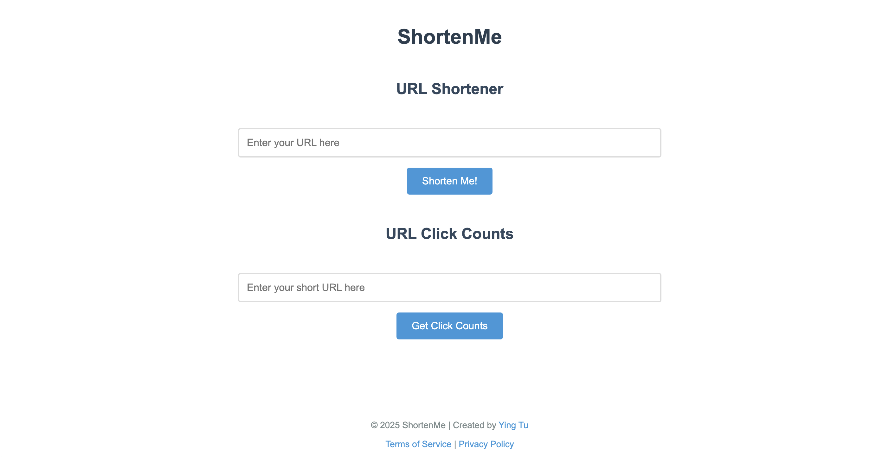
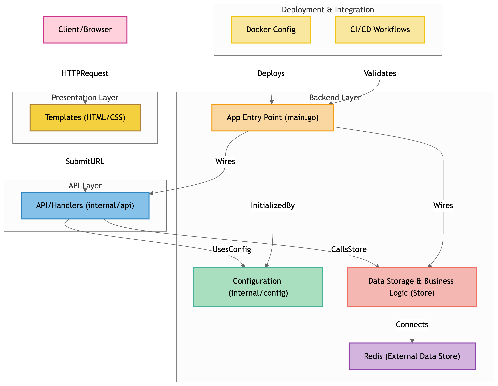

[](https://github.com/yingtu35/ShortenMe/actions/workflows/test.yml)
[](https://github.com/yingtu35/ShortenMe/actions/workflows/golangci-lint.yml)
[](https://github.com/yingtu35/ShortenMe/actions/workflows/docker.yml)
[](https://opensource.org/licenses/MIT)
[](https://go.dev/)
[](https://github.com/yingtu35/ShortenMe/releases)
# ShortenMe

A FREE URL shortener app built with Go. Turn your long URLs into short, memorable links.



## Chrome Extension
The ShortenMe Chrome extension allows you to shorten URLs directly from your browser. You can find it in the [Chrome Web Store](https://chromewebstore.google.com/detail/url-shortener-shortenme/eiojbnimgocofgaecddahbbneamkcedi).

## Features

- 🚀 Fast and lightweight
- 🔒 Secure with rate limiting
- 📊 Click tracking for shortened URLs
- 🌐 RESTful API
- 🎨 Clean and simple web interface
- 🐳 Docker support
- ⚡ Redis-powered storage
- 🔗 Chrome extension support

## Architecture


Credits to [GitDiagram](https://gitdiagram.com/) for the architecture diagram.

## Architecture


Credits to [GitDiagram](https://gitdiagram.com/) for the architecture diagram.

## Prerequisites

- Go 1.23 or higher
- Redis 7.0 or higher
- Docker (optional)

## Installation

### Local Development

1. Clone the repository:
```bash
git clone https://github.com/yingtu35/ShortenMe.git
cd ShortenMe
```

2. Install dependencies:
```bash
go mod download
```

3. Set up environment variables:
```bash
cp .env.example .env
# Edit .env with your configuration
```

4. Start Redis:
```bash
docker run -d -p 6379:6379 redis:7
```

5. Run the application:
```bash
go run cmd/app/main.go
```

The application will be available at `http://localhost:8080`

### Docker

1. Build and run using Docker:
```bash
docker build -t shortenme -f .dockerfile .
docker run -p 8080:8080 shortenme
```

## Usage

1. Visit `http://localhost:8080` in your browser
2. Enter a long URL in the input field
3. Click "Shorten" to generate a short URL
4. Use the short URL to access your original link
5. Track clicks by appending `/click-counts` to your short URL

## API Documentation

### Shorten URL
```http
POST /shorten
Content-Type: application/x-www-form-urlencoded

url=https://example.com/very/long/url
```

### Get Click Count
```http
POST /click-counts
Content-Type: application/x-www-form-urlencoded

shortURL=http://localhost:8080/abc123
```

## Development

### Running Tests
```bash
go test -v ./...
```

### Running Linter
```bash
golangci-lint run
```

## Contributing

1. Fork the repository
2. Create your feature branch (`git checkout -b feature/amazing-feature`)
3. Commit your changes (`git commit -m 'Add some amazing feature'`)
4. Push to the branch (`git push origin feature/amazing-feature`)
5. Open a Pull Request

## License

This project is licensed under the MIT License - see the [LICENSE](LICENSE) file for details.

## Acknowledgments

- [Chi Router](https://github.com/go-chi/chi)
- [Redis](https://redis.io/)
- [DigitalOcean](https://www.digitalocean.com/) for hosting
